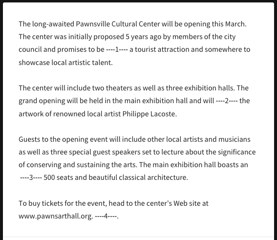
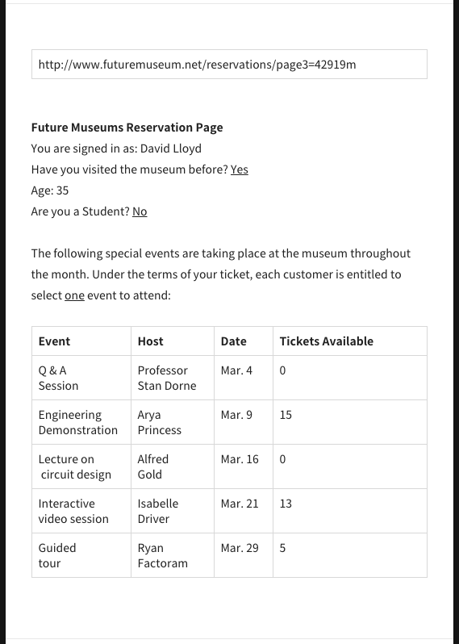
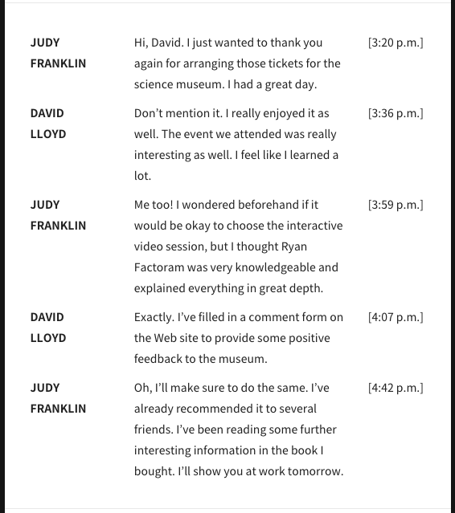

# Riiid! 인터뷰

## 절차
Riiid는 지원자분의 역량과 fit을 효율적으로 파악하기 위하여, 상호적인 기술면접을 진행하고자 합니다.
주어진 시간까지 1차 작업을 하고 현 Riiid 개발자들의 feedback을 반영하여 최종적으로 작업을 하는 방식입니다.
면접과정을 통하여 지원자분 또한 Riiid 웹개발팀의 협업 과정에 대하여 알아가실수 있기 바랍니다.

1. 해당 Repo를 clone 한다.
```
$ git clone https://github.com/GITHUB_ID/REPOSITORY_NAME-GITHUB_ID.git
$ cd REPOSITORY_NAME-GITHUB_ID
```

2. 별도의 branch를 생성하여 작업한다.
```
$ git checkout -b BRANCH_NAME
$ git add/commit/push 
```

3. 1차 제출시 작업중인 branch를 master branch로 [Pull Request(PR)](https://help.github.com/articles/about-pull-requests/)생성를 한다. 
    - 현재 Riiid에서 PR을 통해 같이 작업하는 방식의 [예시](https://apply.riiid.app/677) 입니다.
4. Riiid 개발자들이 PR에 남긴 feedback을 반영하여 최종적으로 기술면접을 수정/제출한다.

# render-passage

## 문제

산타 토익에서 예시로 주어진 RC파트 지문 데이터를 그리세요. 가장 선호하시는 기술을 자유롭게 사용해주시기 바랍니다.

## 예제

토익 RC파트에서 나오는 문단의 형식은 크게 3가지입니다.
1. 평문(e-mail, notificaiton, mail, memo) <br />
  

2. 테이블이 포함된 지문 <br />
  

3. 대화문 <br />
  


## 보너스
아래 문제는 채점자가 지원자분의 코드이해를 돕고자 추가된 질문입니다. 필요하다고 생각하신 경우에만 선택적으로 답변하시면 됩니다.
답변의 형식은 자유입니다.(코드 내의 코멘트, 별도의 파일 등)

1. 뷰와 로직을 분리한다.
2. 데이터를 읽어서 반환하는 비동기 api를 생성하고 이를 사용한다.
3. 문제와 해설을 분류하고, 해설에서는 번역을 보여준다.
4. 문제를 풀수있는 UI를 구현한다.
